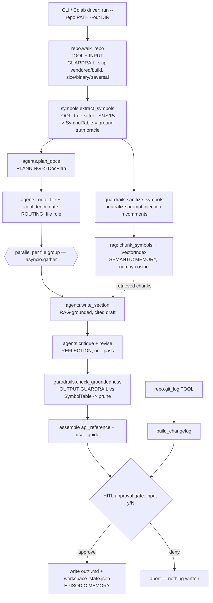

# RepoScribe — Architecture

RepoScribe is an agentic documentation generator. Point it at a code package and it
produces an **API reference**, a **user guide**, and a **changelog** in which every
documented symbol and every citation is verified against a ground-truth symbol table
extracted from the source. It is built to mirror the course labs (Gemini via
`google-genai`, pydantic-typed structured output, a hand-orchestrated async pipeline)
and runs in Google Colab.

## System diagram

## Components

| Module | Responsibility |
| --- | --- |
| `config.py` | Settings + secret loading (`.env` → Colab `userdata`). No hard-coded keys. |
| `models.py` | All pydantic models — they double as Gemini `response_schema`s and internal data. |
| `llm.py` | `GeminiClient` (retry wrapper, `generate`/`generate_json`/`embed`) and a deterministic `MockLLM` with the same interface for offline runs. |
| `repo.py` | `walk_repo` (tool + input guardrail) and `git_log` (tool). |
| `symbols.py` | tree-sitter extraction into a `SymbolTable` — the oracle everything is checked against. |
| `rag.py` | `chunk_symbols` + `VectorIndex` (numpy cosine, semantic memory). |
| `agents.py` | `plan_docs`, `route_file`, `write_section`, `critique`, `build_changelog`. |
| `guardrails.py` | Input sanitization + `check_groundedness` (output guardrail). |
| `pipeline.py` | Hand-written orchestration + the CLI. |

## Design decisions

1. **A tree-sitter symbol table as the source of truth.** The single most important
   decision. Documentation LLMs hallucinate symbols and mis-cite lines; by extracting an
   authoritative `SymbolTable` first, we can *mechanically* reject any documented symbol
   that doesn't exist and any citation that doesn't land inside a real declaration. This is
   what turns "looks good" into measurable coverage/hallucination/citation metrics.
   tree-sitter parses source *text* (no compiler, no `tsc`), so it works on a shallow clone.

2. **Provider abstraction + a deterministic MockLLM.** `GeminiClient` and `MockLLM` share
   one interface, so the entire pipeline, all unit tests, and the eval harness run offline
   with no API key. A TA can reproduce every number with `--mock`; the same code path talks
   to real Gemini with a key. The mock reads compact `SYMBOL:`/`MODULE:`/`FILE:` hint lines
   the prompts already contain, so its output is faithful rather than canned.

3. **numpy vector index instead of faiss.** lab08 uses `faiss.IndexFlatIP`; we reproduce its
   exact semantics (L2-normalized vectors, dot product == cosine) in ~15 lines of numpy. The
   corpus is a few dozen symbols, so brute force is instant, and dropping faiss removes a
   fragile binary-wheel dependency — smoother in Colab and on newer Python.

4. **Hand-orchestrated pipeline (not a framework).** Following lab05_A, orchestration is
   plain Python (`asyncio.gather` + `asyncio.to_thread`), which keeps every stage
   independently testable and the control flow legible. A Colab-safe helper runs the
   coroutines whether or not an event loop is already active.

## Agentic patterns and where they live

| Pattern | Where |
| --- | --- |
| **Planning** | `agents.plan_docs` → `DocPlan`; the pipeline builds exactly the artifacts the plan lists and documents files in the plan's priority order |
| **Routing** | `agents.route_file` + `pipeline.apply_confidence_gate` (confidence < 0.5 → filename heuristic) |
| **Parallelization** | `pipeline.parallel_map` — `asyncio.gather`/`to_thread` over routing and per-file writers |
| **RAG** | `rag.VectorIndex` + `agents._retrieve_context`; every entry cites `file:line` |
| **Reflection** | `agents.critique` + one revise pass in `pipeline.write_group` |
| **Tool use (≥2)** | `symbols.extract_symbols` (tree-sitter), `repo.walk_repo`, `repo.git_log` |
| **Guardrails** | input: `sanitize_symbols`; output: `check_groundedness` + pruning |
| **Memory (≥2)** | semantic: the RAG `VectorIndex`; episodic/working: `WorkspaceState` (persisted JSON) |
| **Human-in-the-loop** | `pipeline._approve` — approval gate before any file is written |
| **Evaluation** | `eval/run_eval.py` — 14 cases, 4 metrics, guardrail ablation |

We deliberately **excluded** an MCP server and a multi-agent (CrewAI/A2A) topology: a
deterministic, single-process pipeline is easier to test and to defend, and the task
doesn't need cross-agent negotiation. These are noted as natural extensions.

## Model / provider choice

**Google Gemini** via the `google-genai` SDK — the provider used throughout the course.
Generation defaults to **`gemini-2.5-flash`** (fast, cheap, strong at structured output);
embeddings use **`gemini-embedding-001`** (lab08). Both are overridable via `GEMINI_MODEL`
/ `GEMINI_EMBED_MODEL`. Temperature is 0 for reproducible structured output. The task is
low-volume (a handful of calls per run), so cost and rate limits are non-issues; the retry
wrapper still handles transient 429/503.

## Secret handling

No key is ever hard-coded. `config.get_api_key()` loads `.env` via `python-dotenv`, then
falls back to Colab Secrets (`google.colab.userdata.get("GEMINI_API_KEY")`) — the exact lab
pattern. `.env` is git-ignored; `.env.example` ships placeholders only. `--mock` needs no
key at all, so tests and eval never touch a secret.

## Limitations

- **Prose is not fact-checked.** The guardrail verifies that symbols and citations are real,
  not that a description is semantically accurate. A fluent-but-wrong sentence passes.
- **Dual-nature symbols** (a name that is both a `const` and a `type`, like `RegistryType`)
  are documented once, dropping the second facet.
- **Unusual export styles.** Public-API detection relies on `export … from` barrel
  statements; wildcard `export *` re-exports are not expanded, so such a symbol could be
  missed by the selector.
- **Language coverage.** Extraction is implemented for TypeScript/TSX/JavaScript/Python;
  other languages return no symbols (they're skipped, not errors).
- **Single-package scope.** Designed for one bounded package; a whole monorepo would need
  chunk-budget management and per-package runs.
